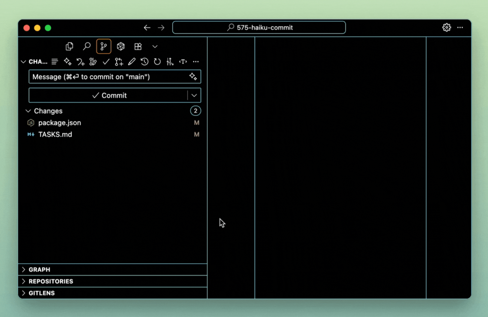
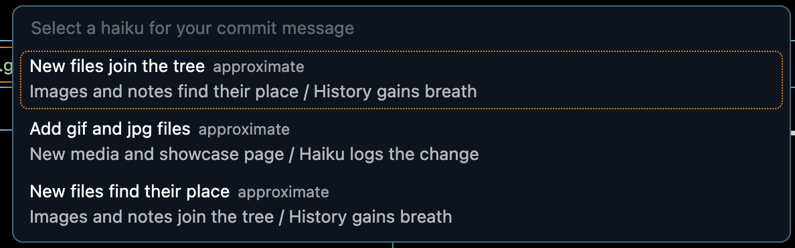
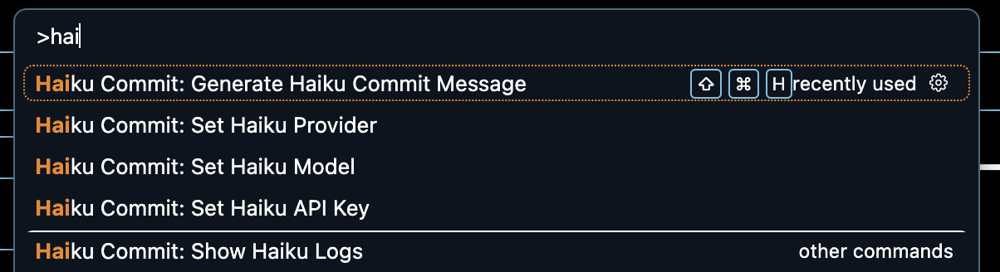
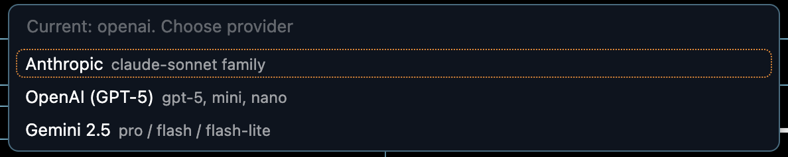
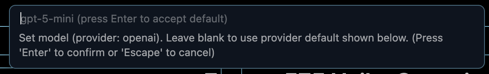

# 📝 575 Haiku Commit

Generate 5‑7‑5 haiku commit messages using AI, right from VS Code’s Source Control panel. Turn everyday commits into tiny poems your team can actually skim.



[](https://marketplace.visualstudio.com/items?itemName=AIMatey.575-haiku-commit)
· [](https://marketplace.visualstudio.com/items?itemName=AIMatey.575-haiku-commit)
· [](https://marketplace.visualstudio.com/items?itemName=AIMatey.575-haiku-commit)
· [](#)
· [](https://github.com/akgrenier/575-haiku-commit/releases)

> **60‑second quick start (users)**  
> 1. Install from Marketplace: `AIMatey.575-haiku-commit`  
> 2. Run “Haiku Commit: Set Haiku Provider” and “Set Haiku API Key” once  
> 3. Stage changes → press `Ctrl+Shift+H` / `Cmd+Shift+H` to generate your first haiku

> **For contributors & docs readers**  
> Skip to [Development](#development) · [Release Prep](#release-prep) · [Learning Guides](#learning-guides)
>

## Table of Contents

**For users**

- [Features](#features)
- [Installation](#installation)
- [Setup](#setup)
- [Usage](#usage)
- [Requirements](#requirements)
- [Extension Settings](#extension-settings)
- [Tips](#tips)
- [Troubleshooting](#troubleshooting)
- [Privacy & Security](#privacy--security)
- [FAQ](#faq)
- [Gallery](#gallery)

**For contributors & maintainers**

- [Development](#development)
- [Manual Validation](#manual-validation)
- [Logging & Diagnostics](#logging--diagnostics)
- [Release Prep](#release-prep)
- [Learning Guides](#learning-guides)
- [Roadmap](#roadmap)
- [Contributing & Policies](#contributing--policies)
- [Maintainers](#maintainers)
- [Support](#support)
- [Versioning](#versioning)
- [License](#license)
- [Credits](#credits)

> Pull request whispers  
> Five–seven–five logs the change  
> Tests nod in silence

## Features

575 Haiku Commit turns staged diffs into short, 5‑7‑5 commit messages that are easy to scan in history while staying fun and memorable for the team.

- 🎋 Generate commit messages in traditional haiku format (5-7-5 syllables)
- 🤖 Multiple providers: Anthropic, OpenAI GPT‑5, and Google Gemini 2.5
- ⚡ Quick keyboard shortcut: `Ctrl+Shift+H` (or `Cmd+Shift+H` on Mac)
- 📝 Automatically fills in the Source Control commit message box
- 🎨 Works with any git repository

## Why this exists

If you already stage small, meaningful diffs, 575 Haiku Commit gives you a crisp 5‑7‑5 commit that teams remember and can skim fast, without bikeshedding over phrasing.

## Installation

### From Marketplace

- Install from the VS Code Marketplace: [575 Haiku Commit](https://marketplace.visualstudio.com/items?itemName=AIMatey.575-haiku-commit)
- Or via CLI: `code --install-extension AIMatey.575-haiku-commit`

### From Source

1. Clone this repository
2. Run `pnpm install` to install dependencies
3. Run `pnpm run compile` to build the extension
4. Press `F5` in VS Code to open a new window with the extension loaded

#### Success check

- Open Command Palette → type "Haiku Commit" → you should see:
  - "Generate Haiku Commit Message"
  - "Set Haiku Provider"
  - "Set Haiku API Key"

### Publishing to VS Code Marketplace

1. Install `vsce`: `npm install -g @vscode/vsce`
2. Package the extension: `vsce package`
3. Publish: `vsce publish`

Note: Do not commit `.vsix` artifacts. Keep built packages local; the CI validates builds, and releases are tracked via tags and GitHub Releases.

## Setup

1. Choose a provider in Settings (`haikuCommit.provider`): `anthropic`, `openai`, or `gemini`. If unset, the extension will prompt you on first use.
2. Get an API key for the selected provider:
   - Anthropic → [Anthropic Console](https://console.anthropic.com/)
   - OpenAI → [OpenAI API Keys](https://platform.openai.com/account/api-keys)
   - Gemini → [Google AI Studio](https://aistudio.google.com/)
3. Open VS Code Settings (`Ctrl+,` or `Cmd+,`) and search for “Haiku Commit”.
4. Either:
   - Enter the key in the matching setting (`haikuCommit.anthropicApiKey`, `haikuCommit.openaiApiKey`, or `haikuCommit.geminiApiKey`), **or**
   - Run “Haiku Commit: Set Haiku API Key” and paste your key when prompted.

The extension will prompt you on first use if a provider or key is missing, so you can also just install, run, and follow the prompts.

## Requirements

- VS Code 1.80.0 or higher
- A git repository
- An API key for the provider you select in [`haikuCommit.provider`](#setup)
  - Anthropic when `provider=anthropic`
  - OpenAI when `provider=openai`
  - Gemini when `provider=gemini`

## Troubleshooting

- **No staged changes** → Stage files first (for example `git add -p`) and rerun.
- **Missing API key or provider** → Run:
  - “Haiku Commit: Set Haiku Provider”
  - “Haiku Commit: Set Haiku API Key”
- **Rate limits or network errors** → The extension retries transient errors with a brief backoff. If failures persist, wait a moment and try again.
- **Non‑git folders** → Commands only work inside a git repository.
- **Need more detail?** → See [Logging & Diagnostics](#logging--diagnostics).

### Setting the API key via command or status bar

- Command Palette: run "Haiku Commit: Set Haiku API Key" to paste your key at any time.
- Status Bar: when no key is configured, a key icon appears ("Set Haiku API Key"). Click it to set your key.

### Switching providers from the Command Palette

- Run "Haiku Commit: Set Haiku Provider" and choose `Anthropic`, `OpenAI (GPT‑5)`, or `Gemini 2.5`. The key prompt and defaults will adjust automatically.

### Setting/Overriding the Model

- Run "Haiku Commit: Set Haiku Model" to set a shared model override.
- You can now pick from a curated dropdown of recommended models per provider, or choose "Custom…" to enter any valid model id.
- If you keep the shared override empty, provider‑specific defaults apply automatically.

Model precedence: the shared override (`haikuCommit.model`) takes priority for all providers. If it’s empty, the provider‑specific model setting is used (`haikuCommit.openaiModel` or `haikuCommit.geminiModel`). If that is also empty, the built‑in default for the selected provider is used.

When switching providers via "Haiku Commit: Set Haiku Provider", the extension offers to auto‑set the recommended model for that provider. If no shared override is set, it sets the provider’s recommended default. If a shared override is present, you can update it, keep it, or clear it to use the provider’s recommended model.

<details>
  <summary><strong>Configured Models</strong> — curated, selectable in the Model picker</summary>

Anthropic

- Claude Sonnet 4.5 (latest): `claude-sonnet-4-5-20250929`
- Claude Sonnet 4 (preferred): `claude-sonnet-4-20250514`
- Claude Haiku 3.5 (fastest): `claude-3-5-haiku-20241022` (alias: `claude-3-5-haiku-latest`)

OpenAI

- GPT‑5 2025‑08‑07: `gpt-5-2025-08-07`
- GPT‑5 Mini 2025‑08‑07 (preferred): `gpt-5-mini-2025-08-07`
- GPT‑5 Nano 2025‑08‑07 (cheapest): `gpt-5-nano-2025-08-07`

Gemini

- Gemini 2.5 Pro: `gemini-2.5-pro`
- Gemini 2.5 Flash Preview (preferred — 1M token context): `gemini-2.5-flash-preview-09-2025`
- Gemini 2.5 Flash‑Lite Preview (cheapest): `gemini-2.5-flash-lite-preview-09-2025`

Notes

- The dropdown shows these curated models per provider and can be updated in `src/providers/models.catalog.ts`.
- You can still enter any valid model id via the “Custom…” option.
</details>

</details>

Or the extension will prompt you for your API key on first use.

## Usage

All methods assume you already have a provider + API key set up (see [Setup](#setup)) and that your changes are staged in git.

### Method 1: Keyboard Shortcut

1. Stage your changes in git
2. Press `Ctrl+Shift+H` (Windows/Linux) or `Cmd+Shift+H` (Mac)
3. Watch as a beautiful haiku appears in your commit message box! 🌸

### Method 2: Command Palette

1. Stage your changes in git
2. Open Command Palette (`Ctrl+Shift+P` or `Cmd+Shift+P`)
3. Type "Generate Haiku Commit Message"
4. Press Enter

### Method 3: Source Control Button

1. Stage your changes in git
2. Look for the haiku button in the Source Control panel title bar
3. Click it to generate a haiku

### Multiple Options (Samples)

If you set `haikuCommit.samples` to a value greater than 1 (max 5), the extension will generate multiple haikus and present a selection list. Pick your favorite and it will be placed in the SCM input box.

## Extension Settings

Core settings include provider, model, strict 5‑7‑5 enforcement, number of samples, and token / retry limits. See VS Code Settings → “Haiku Commit” for the full list.

<details>
  <summary><strong>See all settings</strong></summary>

- `haikuCommit.anthropicApiKey`: Your Anthropic API key for generating haiku commit messages.
- `haikuCommit.strict575` (default: `true`): Enforce exact 5‑7‑5 syllable counts. If the model output doesn’t match, the extension retries with corrective guidance up to two times.
- `haikuCommit.maxDiffLength` (default: `4000`): Maximum characters of the staged diff sent to the AI. Large diffs are truncated with a marker.
- `haikuCommit.samples` (default: `1`, min `1`, max `5`): Number of haikus to generate and choose from.
- `haikuCommit.model` (default: empty): Shared model override (advanced). Precedence: if this value is non‑empty it is used for all providers; otherwise we use the provider‑specific model setting; otherwise the built‑in default (Anthropic: `claude-sonnet-4-20250514`; OpenAI: `gpt-5-mini-2025-08-07`; Gemini: `gemini-2.5-flash-preview-09-2025`).
- `haikuCommit.provider` (default: empty): AI provider. Leave empty to be prompted to choose.
- `haikuCommit.openaiApiKey`: Your OpenAI API key. Required when provider is `openai`.
- `haikuCommit.openaiModel` (default: `gpt-5-mini`): OpenAI model (e.g., `gpt-5`, `gpt-5-mini`, or `gpt-5-nano`). Used only when `haikuCommit.model` is empty. See model guide: https://platform.openai.com/docs/guides/latest-model
- `haikuCommit.geminiApiKey`: Your Gemini (Google AI Studio) API key. Required when provider is `gemini`.
- `haikuCommit.geminiModel` (default: `gemini-2.5-flash`): Gemini model (`gemini-2.5-pro`, `gemini-2.5-flash`, `gemini-2.5-flash-lite`). Used only when `haikuCommit.model` is empty. Docs: https://ai.google.dev/gemini-api/docs/models#gemini-2.5-pro https://ai.google.dev/gemini-api/docs/models#gemini-2.5-flash https://ai.google.dev/gemini-api/docs/models#gemini-2.5-flash-lite
- `haikuCommit.maxTokens` (default: `200`): Token cap for the response payload; lower values shorten outputs, higher values allow more verbose haikus.
- `haikuCommit.maxRetries` (default: `2`): Number of corrective retries when enforcing strict 5‑7‑5 syllable counts.
- `haikuCommit.debug` (default: `false`): Enable verbose logging in the “Haiku Commit” output channel for troubleshooting.

</details>

When strict mode cannot be satisfied after retries, you can choose to use the best attempt, try again, or cancel.

## Data sharing by provider

This extension only sends your staged git diff to the selected AI provider to generate a haiku. Nothing else is transmitted.

- Anthropic: requests are sent to `https://api.anthropic.com/v1/messages`
- OpenAI: requests are sent to `https://api.openai.com/v1/responses`
- Gemini: requests are sent to Google AI Studio endpoints (models `...:generateContent`)

Review your chosen provider’s terms and data policies before use.

<details>
  <summary><strong>Project Structure</strong></summary>

```
575-haiku-commit/
├── src/
│   └── extension.ts      # Main extension code
├── package.json           # Extension manifest
├── tsconfig.json          # TypeScript configuration
└── README.md              # This file
```

</details>

## Development

1. Clone the repository
2. Run `pnpm install`
3. Open in VS Code
4. Press `F5` to start debugging
5. Make changes to `src/extension.ts`
6. Reload the extension window to see changes

> For coding agents: follow the streamlined workflow in `AGENTS.md` for install, watch build, validation, and release preflight steps.

## Manual Validation

Run this quick smoke test before publishing or cutting a release tag:

1. `pnpm run release:verify` — runs secret scanning, rebuilds `out/`, and executes `scripts/test-validate.js`.
2. Launch the Extension Development Host (`F5`) and generate at least one haiku against a staged diff.
3. Toggle each provider command (Set API Key, Set Provider, Set Model) to confirm prompts and status-bar affordances behave.
4. Capture a screenshot or short GIF if UI changed; stash it in `media/` for the release notes.

Document your manual steps in the PR or release notes so reviewers can replay them.

## Logging & Diagnostics

- Default runs are quiet. Startup now logs at debug level only, so the output channel stays silent unless you opt in.
- Enable verbose logs via the `haikuCommit.debug` setting or run "Haiku Commit: Show Logs" to surface the output channel.
- When collecting diagnostics for a bug, include provider, model, `strict575` value, and whether generation hit retries.

## Release Prep

- Run `pnpm run release:verify` locally (or in CI) before publishing.
- Follow the detailed checklist in [`docs/RELEASE_PREP.md`](docs/RELEASE_PREP.md) covering Marketplace packaging, tag pushes, and visibility flips.
- Verify the README Roadmap and screenshots reflect the current UI, then update Marketplace copy as needed.

## Learning Guides

We’re turning this repo into a learning resource alongside the extension. Planned how-to guides will live under `docs/guides/` and cover:

- **First haiku walkthrough:** clone, install, generate, and commit with screenshots.
- **Provider deep-dive:** swapping Anthropic ↔ OpenAI ↔ Gemini, including rate-limit tips.
- **Customization recipes:** tweaking strict mode, samples, tone, and upcoming hybrid message options.

Every guide will ship with a matching issue template so contributors can add tutorials or request new ones. If you want to kick-start a guide, open an issue tagged `learning`, sketch the outline, and we’ll pair up on structure and screenshots.

## Tips

- Stage meaningful chunks of changes for better haikus
- The AI analyzes your actual code changes to create relevant haikus
- Large diffs are automatically truncated to stay within API limits
- If the haiku doesn't fit, you can always generate a new one!

## Troubleshooting

- No staged changes: Stage files first (e.g., `git add -p`) then rerun.
- Missing API key: Run "Haiku Commit: Set Haiku API Key" 
- Rate limits or network errors: The extension retries transient errors with a brief backoff. If failures persist, wait a moment and try again.
- Non‑git folders: The command only works inside a git repository.
- View → Output → select "Haiku Commit" to see logs, or run "Haiku Commit: Show Logs" from the Command Palette.

## Privacy & Security

This extension is designed to keep everything local except the minimum required to generate a haiku.

- Your API key for the selected provider is stored in VS Code Settings on your machine (one of `haikuCommit.anthropicApiKey`, `haikuCommit.openaiApiKey`, or `haikuCommit.geminiApiKey`). It is not committed to this repository.
- The extension sends your staged git diff to the selected provider’s API (Anthropic, OpenAI, or Gemini) for haiku generation. No other data is transmitted.
- No telemetry is collected; the extension does not track usage or send analytics.
- You can remove the key at any time via Settings or by running “Haiku Commit: Set Haiku API Key” and clearing the value.

## Contributing & Policies

- See [CONTRIBUTING.md](./CONTRIBUTING.md) for setup, style, and PR guidelines.
- Read our [CODE_OF_CONDUCT.md](./CODE_OF_CONDUCT.md).
- Security issues? See [SECURITY.md](./SECURITY.md).

Contributions are welcome! Please feel free to submit a Pull Request.

## Maintainers

- Adam Grenier (@akgrenier)

## Support

- Bugs/feature requests → GitHub Issues
- Questions/ideas → GitHub Discussions (or Issues if Discussions aren’t enabled yet)
- Security issues → see SECURITY.md

## Versioning

We follow SemVer. See CHANGELOG.md and GitHub Releases for notes. Breaking changes are called out in release notes.

## Roadmap

- [x] Launch v1 with Anthropic, OpenAI, and Gemini providers
- [ ] Hybrid message mode toggle (switch between haiku then conventional subject and vice versa)
- [ ] Rich UI entry points (SCM toolbar button + activity bar view)
- [ ] Tone/style customization ("zen", "summary", "cheeky")
- [ ] VSCode "creating an extension" in-repo how-to guide series
- [ ] Partial diff QuickPick for staged-file selection
- [ ] Enhanced error UX with actionable guidance
- [ ] Multi-window status bar consistency
- [ ] PR Haiku Bot that comments poetic summaries on pull requests
- [ ] VS Code walkthrough onboarding to showcase haiku generation end-to-end

## FAQ

- Q: Do I need an API key?
  - A: Yes. Set the key for the provider you choose (Anthropic, OpenAI, or Gemini). The extension prompts you if it’s missing.
- Q: Does my code get uploaded?
  - A: Only the staged git diff is sent to the selected provider to generate the haiku.
- Q: Can I switch providers?
  - A: Yes. Run “Haiku Commit: Set Haiku Provider” and choose Anthropic, OpenAI, or Gemini.
- Q: Why is a haiku sometimes labelled “approximate”?
  - A: With `strict575=false`, we still show whether the output truly matches 5‑7‑5; otherwise it’s labelled approximate.

## Gallery

<details>
  <summary><strong>Open Gallery</strong> — screenshots and GIFs</summary>


_Stage changes, press Cmd+Shift+H, haiku appears._


_SCM commit message box filled with a 5‑7‑5 haiku._


_Success notification after generation._


_Status bar key prompt when an API key is missing._


_Choose Anthropic, OpenAI (GPT‑5), or Gemini 2.5._


_Optional shared model override input._


_Secure input box for provider API key._

[Back to top](#-575-haiku-commit)

</details>

## License

MIT

## Credits

Built with ❤️ using:

- [VS Code Extension API](https://code.visualstudio.com/api)

---

**Enjoy your poetic commits!** 🌸📝✨
